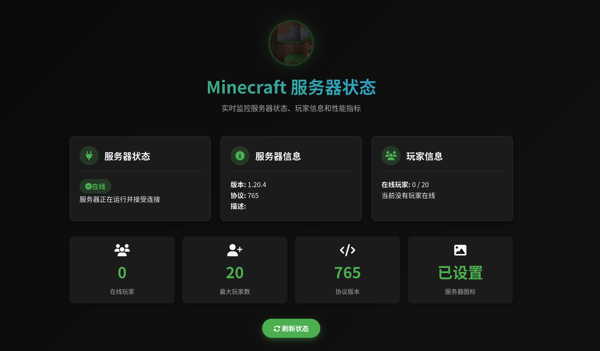

### minecraft服务器状态查看



```shell
# 运行
docker run -d \
  --restart=always \
  -p 8082:80 \
  -e SERVER_HOST=192.168.195.35 \
  -e SERVER_PORT=25565 \
  --name minecraft-server-status \
  registry.cn-hangzhou.aliyuncs.com/jcleng/jcleng-minecraft-server-status:latest
```
